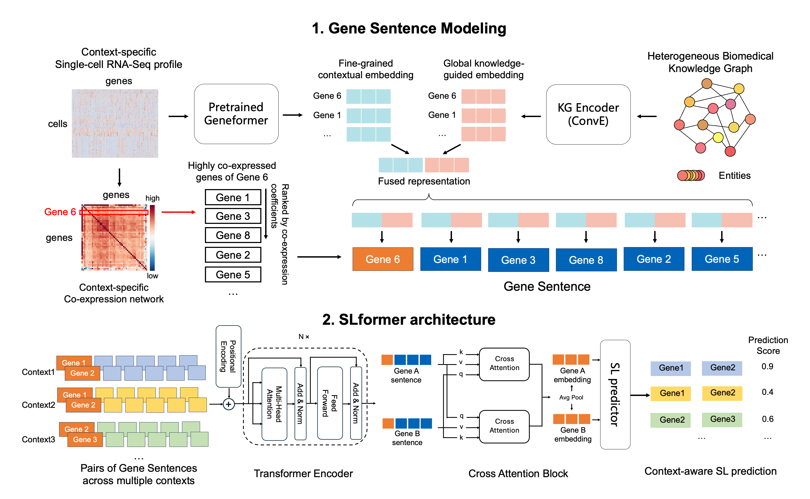

# SLformer
**SLformer** is a Transformer-based framework for predicting context-specific synthetic lethal (SL) interactions from single-cell RNA-seq data. It represents each gene as a co-expression gene sentence, enabling language-model architectures to capture context-dependent gene interaction rewiring. 



## Environment Setup
```bash
git clone https://github.com/JieZheng-ShanghaiTech/SLformer.git
cd SLformer
conda create -n slformer python=3.8
conda activate slformer
pip install -r requirements.txt
```

## Preparing Input Data

### Gene Sentence construction
We provide precomputed gene sentence data derived from the single-cell expression data we used in this study, along with other auxiliary data required for later model training and downstream analyses, which can be downloaded [here](https://doi.org/10.5281/zenodo.18733691). 

If users wish to construct gene sentences from their own single-cell datasets, follow the instructions below.

#### Constructing Gene Sentences from custom single-cell data
```
python slformer/preprocess.py --config_file=/path/to/data_config_file.yaml
```

`config_file` is a .yaml configuration file that should specify the following:
- `sc_dir`: Directory containing a `raw` sub directory with single-cell expression data (.h5) and cell type metadata (.tsv)
- `SAVED_DATA_DIR`: Output directory for saving generated gene sentence data and other auxiliary data
- `Geneformer_dir`: Root directory of GeneFormer source codes.
- `geneformer_gene_info_path`: A .csv table that gene meta data used by GeneFormer (Ensembl id, gene symbol, and gene type)
- `sc_samples`: Dictionary specifying cancer types and corresponding sample ids (i.e. the h5 file names)

See `config/data_preprocess.yaml` as an example.

Running the preprocessing pipeline produces key outputs as following:
```text
sc_dir/
├── processed/
│   └── *.h5ad
│       # Processed single cell data restricted to malignant cells
│       # and genes shared across all samples
├── coexp_data/
│   └── *_coexp.csv
│       # Gene by gene co expression matrices for each cancer type
└── gene_sentence/
    └── gene_sentence_n{sent_len}/
        # Constructed gene sentence datasets with sentence length n

SAVED_DATA_DIR/
└── map/
    ├── gene2id.pkl
    │   # Mapping from gene symbol to integer ID
    ├── geneformer_emb.pkl
    │   # Geneformer embeddings computed from the processed single cell data
    ├── gene2sent_n{sent_len}.pkl
    │   # Mapping from root gene ID to the list of gene IDs forming its gene sentence
    └── sent_mask_n{sent_len}.pkl
        # Boolean masks indicating padding positions in gene sentences
```

### Preparing SL training and test data
To generate SL training data and indepedent test data, run the following script:
```
python slformer/prepare_data.py --data_config_file=/path/to/data_config_file.yaml
```
`data_config_file` can be the same configuration file used for preparing gene sentence data. But it has to additionally specify `SL_dataset` including dataset type and dataset path information. See `config/data_preprocess.yaml` as an example.

The generated SL training data will be saved under `config.SAVED_DATA_DIR/SL_train_test_data`.

## SLformer Usage

For either SLformer model training or inference, use the same core command below

```
python slformer/main.py \
    --data_config_file=/path/to/data_config_file.yaml \
    --config_file=/path/to/task_config_file.yaml \
```
- `data_config_file` is the same config file used in previous input data preparation steps
- `config_file` is a task-specific configuration file defining experimental settings. Examples can be found under `config/train` and `config/inference`. The task name (specified by the file name) must match one of the entries registered in `slformer.task.EXPERIMENT_REGISTRY`.

### Supported tasks
#### Training tasks
- `cancer_specific`: Train and validate SLformer on individual cancers
- `mixed_cancer`: Train and validate SLformer jointly across multiple cancers
- `cross_cancer`: Train on all but one cancer type amd validate on the held out cancer

#### Inference tasks
- `independent_test`: Perform inference on independent test datasets using trained checkpoints
- `get_emb`: Extract SLformer learned gene embeddings for a specified pair of genes
- `get_att`: Extract gene sentence attention maps for a specified pair of genes
- `IDH1_DDR_inference`: Predict SL scores between IDH1 and a list of DDR (DNA damage response) genes under a specified cancer type
- `IDH1_PRKDC_inference`: Predict SL score between IDH1 and PRKDC under a specified cancer type
- `IDH1_permute`: Peform bootstrap-based ranking of a set of candidate partner genes with IDH1 as the primary SL gene

## Analysis and Visualization
Scripts and notebooks for generating figures and additional analysis in this study can be found under `notebooks/`.

>[!NOTE]
> Running `/notebooks/LLM_interpretation` requires configuring `notebooks/LLM_interpretation/prompt_api/client_config.yaml`; model endpoint settings are read from the configured `model_config_dir/model_config.yaml`.


## How to Cite